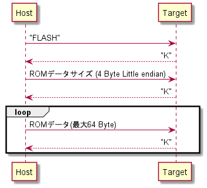

# SE Button ファームウェア

## 概要

非圧縮音声データをEEPROMに書き込み・スピーカーで再生する

音声データは複数書き込みでき、
ボタンを押すたびに重み付け乱数でどの音声を再生するか決定する。

**重み0の音声が存在する場合、順番どおり音声が再生される**

## プロジェクト環境

|項目|仕様|
|-|-|
|IDE　| MPLAB X ver 5.50|
|コンパイラ　| XC8 ver2.32|

## ハードウェア

|項目|仕様|
|-|-|
|MCU　| PIC16F18324|
|EEPROM | 24FC256 |
|スピーカドライバ | TC118SS |

## 音声データ仕様

|項目|仕様|
|-|-|
|サンプリングレート|8000 Hz|
|ビット深度|8 bit|
|チャンネル|1 ch|

### 最大仕様

**音声個数は8個まで**。

最大合計音声長は音声個数をNとすると
```math

2^{15}-(4+3N)[\mathrm{sample}]

```
秒にすると
```math

\frac{2^{15}-(4+3N)}{8\times10^3}\simeq4.09[\mathrm{sec}]

```

## ROM内データ仕様

| 項目 | 開始アドレス | 長さ(Byte) | 内容 |
|-|-|-|-|
| ヘッダ            | 0     | 3 |ASCII文字で"PCM"|
| 音声個数          | 3     | 1 |$N$|
| 音声0サイズ       | 4     | 2 |$L_0$|
| 音声0重み         | 6     | 1 |$W_0$|
| 音声1サイズ       | 7     | 2 |$L_1$|
| 音声1重み         | 9     | 1 |$W_1$|
| ...               |       |   ||
| 音声$n$サイズ     | $4 + 3n$          | 2 |$L_n$|
| 音声$n$重み       | $4 + 3n+1$        | 1 |$W_n$|
| ...               |                   |   ||
| 音声0データ       | $4 + 3N$          | $L_0$ ||
| 音声1データ       | $4 + 3N + L_0$    | $L_1$ ||
| ...               |                   |   ||
| 音声nデータ       | $4 + 3N + \sum_{k=0}^{n-1}{L_k}$  | $L_n$||
| ...               |                   |   ||

音声データはヘッダ部などを持たない純粋なデータのみ。
振幅はwaveファイルの深度8bitと同様で0x80を中心とする符号なし8bit整数。

サイズはLittle Endianで格納される。

重みはその音声が再生される割合で、すべての重みが0以外の場合に重みに応じた確率で音声が再生される。
音声nが再生される確率は

```math
\frac{W_n}{\sum_{k=0}^{N-1}(W_k)}
```

となる。

## 書き込み仕様

|項目|仕様|
|-|-|
|プロトコル|UART|
|ビットレート| 57600 bps |
|データ|8 bit|
|パリティ|なし|
|ストップビット|1 bit|

### 書き込みシーケンス

書き込まれる本体を`Target`,書き込むPCなどを`Host`とする。

`Host`から通信を開始し、`Target`はAckを返す。基本はASCII文字で`K`と返す。
データに何らかの問題があった場合`E`を返す。

`Host`はASCIIで`FLASH`,ROMデータサイズ,ROMデータの順に送る。
サイズはLittle Endianで送る。

ROMデータは先のROM内データそのもので、
書き込む場合は**64Byteごとに`Target`のAck**を待つ必要がある。
サイズが64で割り切れない場合でもROMデータサイズに到達した場合Ackが帰ってくる。


